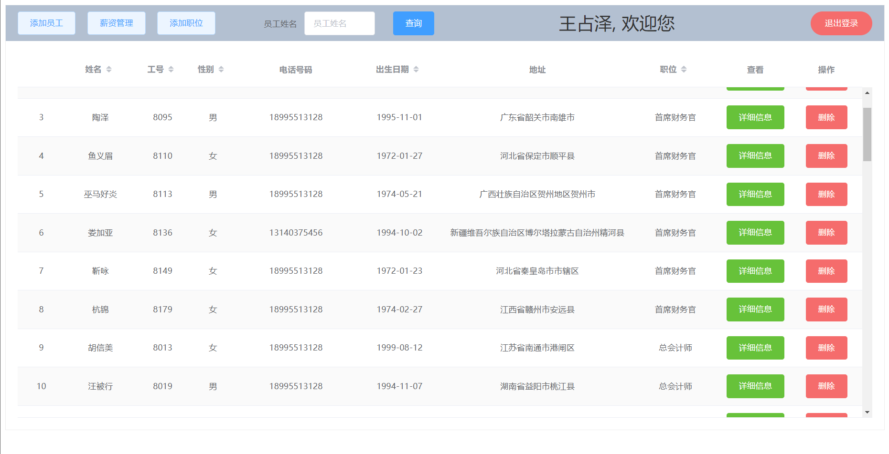
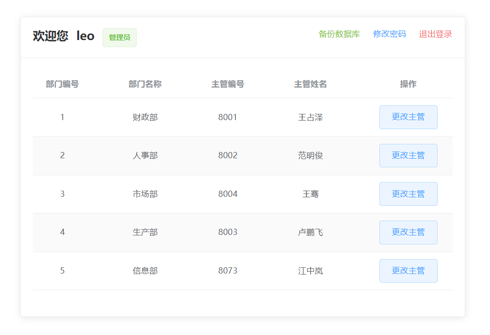
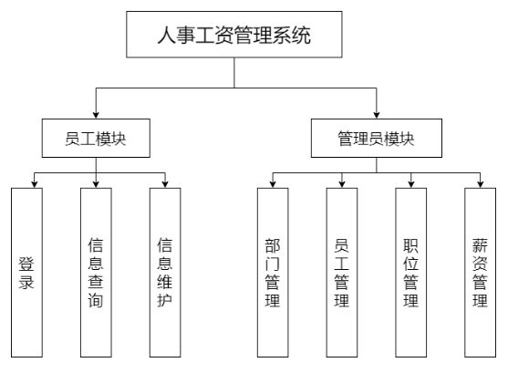
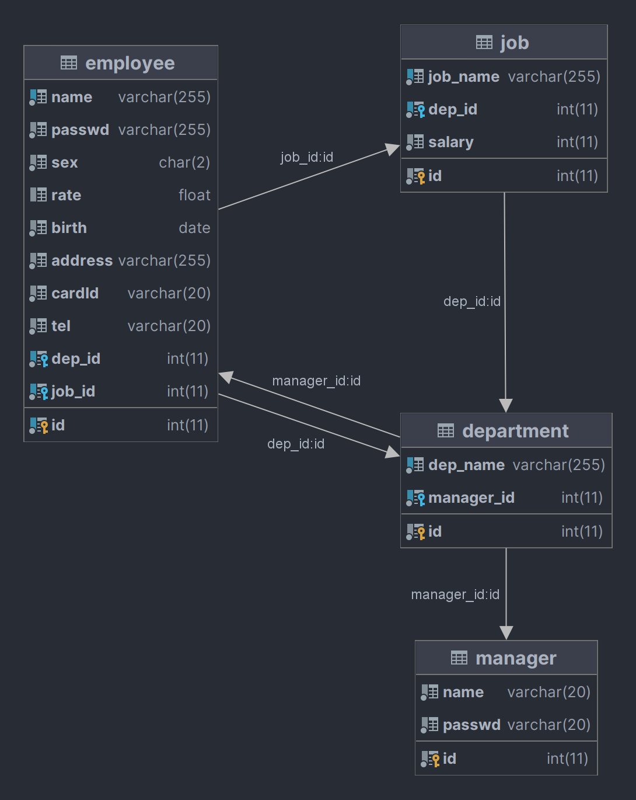

# 人事工资管理系统

## 项目信息

> 项目起草时间: 2022年4月3日
>
>   项目开始时间: 2022年5月7日
>
>   项目结束时间: 2022年5月14日

项目用户: 系统管理员, 部门主管, 普通员工

```
系统管理员: 更改部门主管
部门主管: 管理员工信息, 管理职位信息, 管理薪资信息
普通员工: 查看工资信息, 查看修改个人信息
```

- 编程语言: `Java`
- 系统结构: `B/S`
- 数据库: `MySQL`
- 技术栈: `Vue`, `Mybatis`, `ElementUI`, `Servlet`

## 总体需求

人事工资管理系统，旨在实现工资的集中管理。
可供财务人员对本单位的人员以及工资进行增加、删除、修改、查询，
对人事的管理及工资发放中的应发工资合计等项目由系统自动进行计算；
同时系统还可对人事及工资管理情况进行多角度查询。员工可通过系统对自己的工资详情进行查询。

## 系统界面

### 部门主管页面



### 员工页面


### 系统管理员页面



## 总体架构



与人事工资管理相关的组织机构有：管理员，部门，员工，职位。
系统主要有两种用户，管理员和普通用户。系统使用者可以使用系统管理密码实现对管理员用户的增加、删除。管理员用户可以进行员工管理、部门管理、职位管理和薪资管理操作。普通用户可以个人信息查询以及修改、薪资查询等操作。
一个部门下有多个员工，一个员工只属于一个部门。
一个员工有且只有一个职位，多个员工职位可以相同。
一个职位属于一个部门，一个部门下可以有多个职位。

## 业务需求

1.员工功能：

    1)员工登录：实现普通员工登录。

    2)信息查询：员工可以查看自己的基本信息。

    3)信息维护：员工可以维护自己的基本信息，如地址、电话等。

2.管理员功能：

    1)部门管理：实现对部门进行管理，管理员通过这个功能实现对部门信息的查询，部门员工的查询，对部门信息的更新，
        对部门下职位的查询，对部门的增加、修改、删除以及查看所有部门信息等功能。

    2)员工管理：实现对员工进行管理，管理员通过这个功能实现对员工信息的更新，对员工所在部门的修改，
        对员工的删除、增加等一系列操作。

    3)职位管理：实现对员工职位进行管理，包括对职位所在部门的调动，对职位的增加、删除。

    4)薪资管理：实现对员工薪资进行管理，管理员通过这个功能实现对员工薪资进行修改。

3.信息要求：

    1)管理员信息：管理员的编号，管理员账户，管理员密码。

    2)员工信息：员工编号，员工姓名，员工密码，性别，出生日期，身份证号码，
        民族，籍贯，联系电话，住址，部门编号，职位编号。

    3)部门信息：部门编号，部门名称，部门负责人。

    4)职位信息：职位编号，职位名称，部门编号。

4.安全性要求：

    1)系统设置访问用户的标识以鉴别是否是合法用户，并要求合法用户设置其密码，保证用户身份不被盗用；

    2)系统应对不同的数据设置不同的访问级别，限制访问用户可查询和处理数据的类别和内容；

    3)系统应对不同用户设置不同的权限，区分不同的用户，如普通职工和管理员。
        普通职工（只能查询个人、薪资信息和更新个人信息）；
        管理员（可以管理部门、员工、职位、薪资等信息）；
        系统管理密码拥有者（可以增加和删除管理员）。

5.完整性要求：

    1)各种信息记录的完整性，信息记录内容不能为空；

    2)各种数据间相互的联系的正确性；

    3)相同的数据在不同记录中的一致性。

## 数据库信息



1. 员工表

```mysql
-- auto-generated definition
create table employee
(
    id      int,
    name    varchar(255)    not null,
    passwd  varchar(255)    not null,
    sex     char(2)         not null,
    rate    float default 0 null,
    birth   date            not null,
    address varchar(255)    not null,
    cardId  varchar(20)     not null,
    tel     varchar(20)     not null,
    dep_id  int             not null,
    job_id  int             not null,
    constraint employee_ibfk_1
        foreign key (dep_id) references department (id),
    constraint employee_ibfk_3
        foreign key (job_id) references job (id),
    constraint employee_ibfk_4
        foreign key (dep_id) references department (id)
)
    engine = InnoDB;

create index dep_id
    on employee (dep_id);

create index idx_emp_id
    on employee (id);

create index idx_name
    on employee (name);

create index job_id
    on employee (job_id);

alter table employee
    add primary key (id);

alter table employee
    modify id int auto_increment;
```

2. 部门表

```mysql
-- auto-generated definition
create table department
(
    id         int auto_increment primary key,
    dep_name   varchar(255) not null,
    manager_id int          not null,
    constraint department_ibfk_1
        foreign key (manager_id) references employee (id),
    constraint department_ibfk_2
        foreign key (manager_id) references employee (id)
)
    engine = InnoDB;

create index idx_name
    on department (dep_name);

create index manager_id
    on department (manager_id);

grant select on table department to leo;
```

3. 职位表

```mysql
-- auto-generated definition
create table job
(
    id       int auto_increment
        primary key,
    job_name varchar(255) not null,
    dep_id   int          not null,
    salary   int          not null,
    constraint job_ibfk_1
        foreign key (dep_id) references department (id)
            on update cascade on delete cascade
)
    engine = InnoDB;

create index dep_id
    on job (dep_id);

create index name_idx
    on job (job_name);
```

4. 系统管理员表

```mysql
-- auto-generated definition
create table manager
(
    id     int auto_increment
        primary key,
    name   varchar(20) not null,
    passwd varchar(20) not null
)
    engine = InnoDB;
```